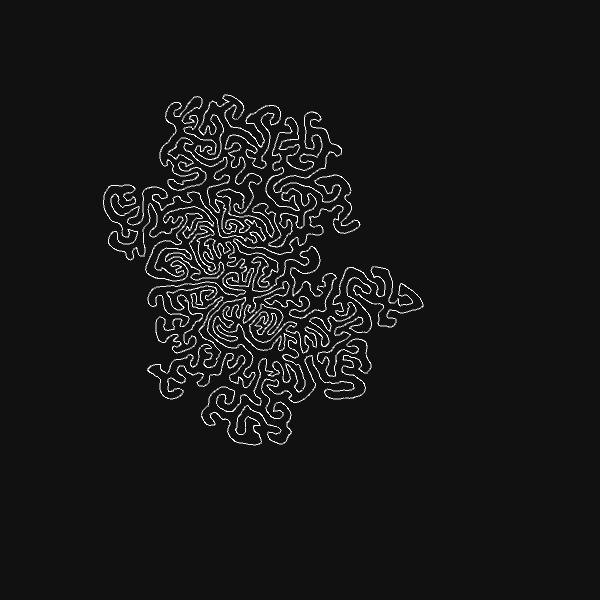
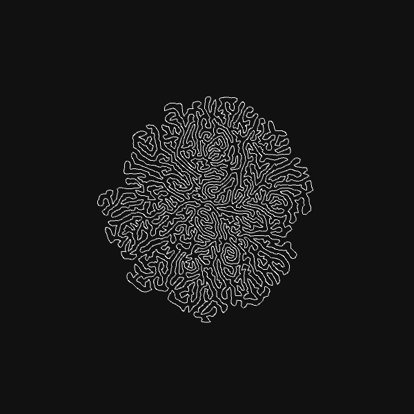
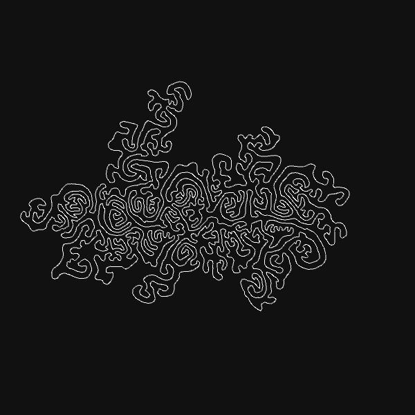
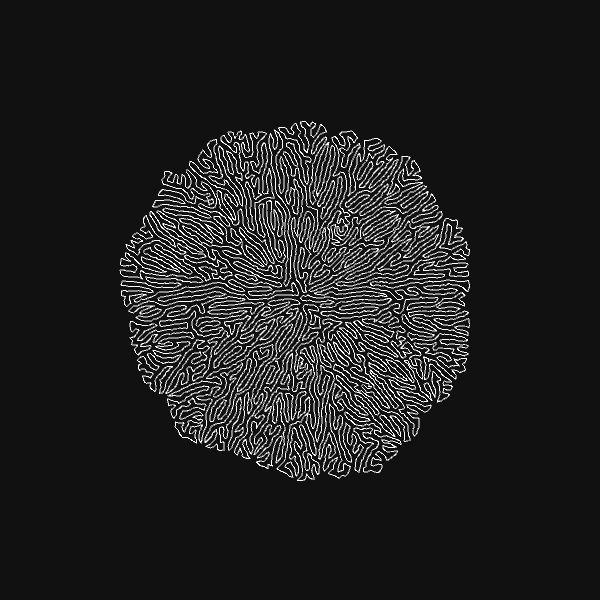
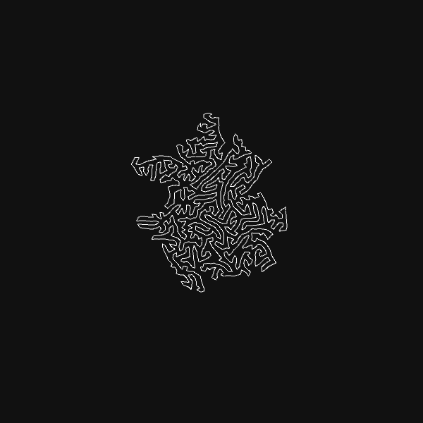

Converting Processing output to .obj for 3D printing purposes

<b>Requires</b>
-Processing from: https://processing.org/download/
-ExportOBJ from: https://n-e-r-v-o-u-s.com/tools/obj/  

Examples with parameters:

maxForce = 1.00, maxForceNoise = 2.75, maxSpeed = 1.4, desiredSeparation = 8, separationCohesionRation = 1, maxEdgeLen = 5

maxForce = 1.00, maxForceNoise = 2.75, maxSpeed = 1.4, desiredSeparation = 8, separationCohesionRation = 1, maxEdgeLen = 5

maxForce = 1.00, maxForceNoise = 3.00, maxSpeed = 1.0, desiredSeparation = 9, separationCohesionRation = 1, maxEdgeLen = 5

maxForce = 1.00, maxForceNoise = 3.00, maxSpeed = 1.0, desiredSeparation = 10, separationCohesionRation = 1, maxEdgeLen = 5

maxForce = 1.00, maxForceNoise = 3.00, maxSpeed = 1.0, desiredSeparation = 8, separationCohesionRation = 3, maxEdgeLen = 5

maxForce = 1.00, maxForceNoise = 1.00, maxSpeed = 1.0, desiredSeparation = 5, separationCohesionRation = 1, maxEdgeLen = 5

maxForce = 1.00, maxForceNoise = 1.00, maxSpeed = 1.0, desiredSeparation = 5, separationCohesionRation = 1, maxEdgeLen = 8

maxForce = 2.50, maxForceNoise = 1.50, maxSpeed = 2.0, desiredSeparation = 5, separationCohesionRation = 0.5, maxEdgeLen = 8
